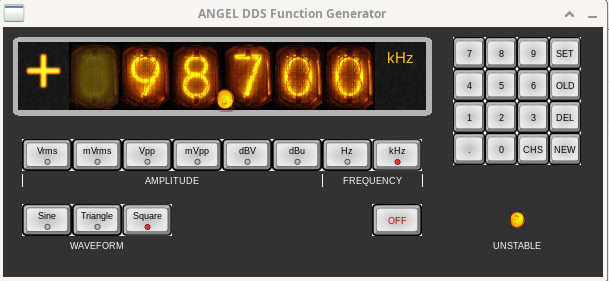
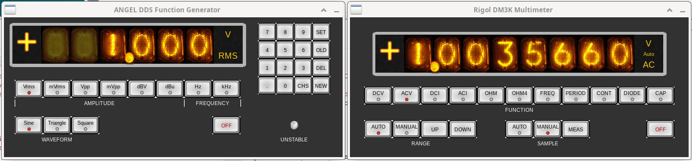
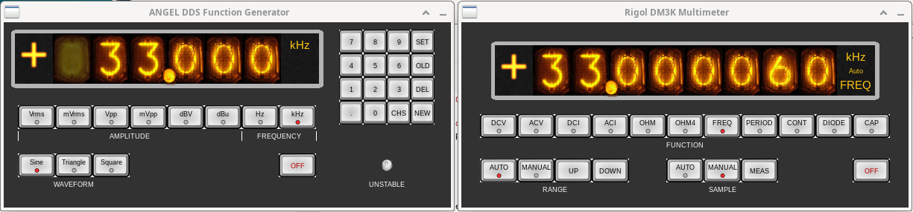
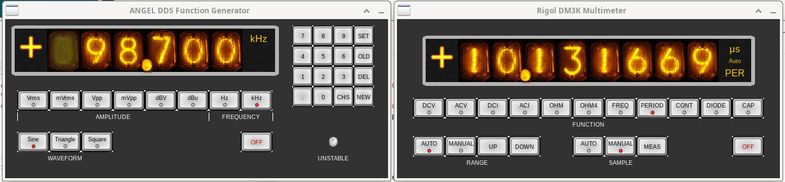
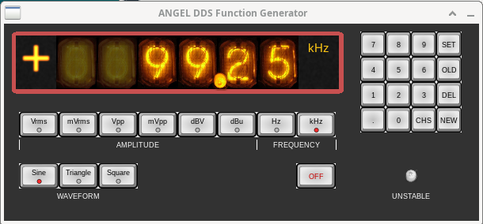

# VCPGUI - Virtual Control Panel Graphical User Interface

A somewhat special purpose GUI for making "virtual control panels"
for electronic test and measurement devices, and some application
programs that use it.

Some "less travelled" paths in technology are taken.

Here is an example of a "virtual control panel" created using this
software:

---

---

## Introduction

This project started with a desire to provide a user interface for a home
made function generator (an electronic instrument that can output sine,
triangle or square waves at a precise frequency and fairly precise
amplitude). This thing is controlled internally by an Arduino Uno and "understands"
a small set of commands sent over a "serial" line (physically, USB). It
has no control panel and can only be controlled externally by sending it commands
from a computer. I have been using Python to do this for over 8 years
now, but never got around to creating any kind of GUI for it.

I have other, similar, projects as well as a small set of commercial
instruments that can be controlled using USB TMC (Test and Measurement
Class) with SCPI (Standard Commands for Programmable Instruments)
commands. It would be nice if all of these could be controlled by a GUI
running on a laptop or other computer.

The "obvious" way to do this is to continue to use Python, which has
several packages that "talk" USB TMC directly or via VISA (Virtual
Instrument Software Architecture) and a library for serial communications.
It also has several choices for constructing a GUI (such as TkInter and
Qt via PySide or PyQt).

However, there were a few "reasons" to not take the "obvious" route. 
Perhaps not very good "reasons" (or proper "reasons" at all, arguably),
but here they are:

- Before retiring, I had used Python and PyQt/PySide *a lot*. Using something else
  was appealing, just for a change.
- I wanted a "GUI" that looked more like physical control panels than
  could easily be achieved with the usual GUI toolkits. 
- I had some quite decent pictures of Nixie tubes showing all the decimal
  digits (taken from my old HP 3430 voltmeter with a Fujifilm S7000, both
  now gone to other owners, regrettably). I wanted to use these for "numeric
  displays".
- Back in the 'noughties, I had come across a marvellous piece of software
  called "Algol 68 Genie" (A68G for short below), 
  an interpreter / compiler written by Marcel van
  der Veer. As you would expect, this lets you write software in the "old"
  Algol 68 language on modern platforms. I wanted to use this for something
  ever since I discovered it. A bit more on this below.
- GUI toolkits tend to be large and complex (in the case of Qt, huge). How
  small and simple can a GUI be while still being useful, even if only for
  a limited set of applications? (There are some lightweight GUIs out there,
  such an "Dear ImGui" and "GuiLite", but I'm not familar with these as yet).
  It might be interesting to see how little code we can get away with ...

So, the plan became:

- Keep as much of the GUI logic in Algol 68 running on Algol 68 Genie as
  possible. As A68G is an interpreter (as well as a compiler) this might
  give many of the same "rapid application development" benefits that come
  from using Python.
- Write all application programs (that use the GUI) in Algol 68 (for A68G).
- Not all application programs need to use the GUI. Being able to "script"
  the activities of test and measurement equipment is actually essential. Using
  an interpreted language is very advantageous for this sort of work, and A68G
  provides that.
- Draw GUI components, primarily using texture images stored in a texture atlas,
  using SDL (Simple DirectMedia Layer). SDL now has three somewhat incompatible
  major versions, with SDL 3 being the current version still under development.
  At present, though, we will use SDL 2. Using SDL for the "GUI backend" makes
  the thing quite portable, in principle, although I am primarily interested
  in targetting Linux and, to a lesser degree, macOS.
- A68G has no Foreign Function Interface (FFI) as such. Short of adding new
  code into the A68G interpreter/compiler itself, I don't think there is any
  way of calling external libraries written in, say, C or C++. The FFI capabilities
  of Python are one of its greatest advantages. However, there is a workaround
  which works perfectly well for this project's purposes: A68G can launch another
  process and communicate with it using pipes. We can therefore write "helper
  programs" in C++ that are linked with SDL 2, or libusb or can access the 
  operating system's serial i/o capabilities. By writing to and reading from the
  pipes connected to the "helper programs", we can (indirectly) access essentially
  any C, C++ or Fortran library code we may need. Admittedly, this is not a very
  high performance solution, but it turns out to be quite fast enough for this
  project.

There is another "reason" for using Algol 68 for this work. Some 46 years ago (1980),
I wrote what may be the worst Algol 68 program ever written (to analyse data for
a final year undergraduate experimental physics project). It worked (eventually), but
it was terrible. Maybe not so surprising, as the only code I had previously written
was in Dartmouth BASIC (quite a big step up from that to A68!). I wanted to see what
the language was really like now I have more experience.

Algol 68 Genie has proved to be robust, fast and capable. I have encountered zero
problems with it. None. The Algol 68 language's "last stable release" was 1973 -- 53
years ago, so it naturally has some omissions when compared to today's popular
languages. But it was *far* ahead of its time and feels surprisingly "modern". The
main limitation is that it is a purely imperative, procedural language. Most
"popular" languages these days are "multi-paradigm", mixing together procedural, 
object oriented, functional and other features for greater "generality". Algol 68 perhaps
could benefit from some way of better controlling symbol visibility (e.g. "module" or
"namespace" features). It would be good to have more polymorphism (operators can
be polymorphic, but not procedures). Apart from that, to my mind, it is pretty 
much perfect as a procedural language: elegant, expressive and concise. 
This is, of course, a purely subjective opinion!

## Component parts

As an interpreter, Algol 68 Genie does not make use of object libraries. Instead, we
can reuse functionality through "preludes" -- source code that is "included" and
interpreted along with the application ("particular-program") code. This is the same
approach as "header-only libraries" in C++. 

The VCPGUI project has a number of these "preludes" that are included as needed in
the application programs. These, and the other VCPGUI code, fall into the
following categories.

Detailed documentation on the operators and procedures defined in the "preludes",
automatically extracted from the source code, can be found [here](doc/vcpdoc.md).

### VCPGUI itself.
The VCPGUI "API" is defined in the file: `vcpgui.a68`. The procedures in there allow
a user to define the GUI components, "callback" functions that respond to interactions
with those components, and lay out those components in a window, thus creating the
"virtual control panel". 

The overall logic follows the usual pattern: declare the UI components, then call a
function which instantiates the defined components, then run an event loop which
fields all user interactions with the GUI and calls any associated callback functions.

Note that one omission is there are no "layout automation" features. There are functions
which will calculate the sizes of declared componnents and generate coordinates to
distribute or align components relative to others, but the user must specify coordinates
for each component (actually the centre positions).

### Helper programs

These are written in C++, normally started by calling Algol 68 procedures, and communicate
with code written in Algol 68 over pipes. The following helper programs exist:

- DSURF (`dsurf.cpp`) is responsible for opening a window on a (local) display, drawing
  graphical elements for the GUI components and fielding user interactions (mouse and keyboard)
  with those GUI components. The Algol 68 VCPGUI code writes drawing commands to the stdin
  of DSURF and reads interaction notifications from the stdout of DSURF. DSURF maintains a
  display list (descriptions of things to draw) so it can handle redraws due to window system
  events itself. The command protocol between the A68 code and DSURF is not at all optimised
  (it is human readable), nor is the display list stored efficiently, but the result is quite
  fast enough (based on current applications). As noted, DSURF uses SDL 2 to do its work.
  Most GUI elements are drawn with texture mapped rectangles. The textures used are stored
  in two files: a PNG file containing all the images (the texture atlas image) and a
  file that describes the locations of named textures in the texture atlas image. The default
  files are: `dsurf.png` and `dsurf.tal`. Much of the appearance of the GUI can be changed
  simply by changing these files (or even just the PNG file). For example, LED numeric displays
  could easily be created instead of Nixie tube displays. Note that the PNG image has an alpha
  channel, which is essential for certain effects.
- SerialIO (`serialio.cpp`) is responsible for sending and receiving data on a serial line
  (usually `/dev/ttyACMn` on Linux) at a specified baud rate, parity and number of data and 
  stop bits. Again, the A68 code simply writes what it wants to send to stdin of SerialIO and
  reads responses from stdout of SerialIO.
- TMCUSBIO (`tmcusbio.cpp`) is responsible for communicating with test and measurement devices
  over USB. As with the above "helpers", the A68 code writes what it wants to send to stdin of
  TMCUSBIO and reads responses from its stdout. TMCUSBIO is linked with libusb and implements
  necessary parts of the TMC protocol itself. 

  > NOTE: Communicating reliably with USB TMC devices
  has been by far the most problematic part of this whole project. Initially, the Linux kernel USBTMC
  driver was used, with A68 code simply opening `/dev/usbtmc<n>` and writing to / reading from
  that. This could work without error for thousands of transactions, then, on the next open,
  fail. Debugging this with a C++ program revealed the same behaviour, with `EPROTO` errors
  randomly happening after a new open. To give more opportunity for workarounds, I moved to
  using the (mostly) user space libusb functionality instead. But this *also* has the same
  problem! At first, it seemed the only certain "fix" for this once it happened was to power down
  the host computer and start again. A slightly better alternative also turned out to work:
  restart the USB subsystem. There is a `restart_usb.sh` Bash script provided as a template
  for doing this. It would be unwise to use this if USB attached disks are in use! It might
  be possible to further restrict the restart to a single port. *However* it is the case
  that USB TMC communications remain unreliable -- if it works after an open, it will keep
  working ... but it randomly fails to work after a new open. It isn't clear if this is a
  quirk of the host computer hardware and instruments I happen to be using or a more general
  problem. There are many reports of similar issues out there, though.

One benefit of having helper programs of this kind is that SerialIO and TMCUSBIO can be run
from the command line directly and the user can simply type commands to be sent to an instrument
and view the responses. This may occasionally be useful.

### General purpose preludes

There are a number of "preludes" that are likely to be useful in many application
programs. Specifically:

- `utility.a68` provides a wide variety of frequently useful functions (A68G has quite
  a lot of "batteries included" functions, but this adds quite a few more). Specifically:
    - Some time related routines, such as simple arithmetic in hours, minutes and seconds.
    - Routines for clamping numbers to ranges and min and max functions.
    - Many routines for trimming white space from strings, classifying strings and so on.
    - Many routines for converting strings to INTs and REALs and vice versa.
    - Functions for opening files and character devices in familiar ways.
    - Functions for splitting filenames and paths (getting extensions, base name, etc.)
    - Functions for reading and writing 1D and 2D arrays (row and row,row) of REALs to/from files.
    - Some other simple array functions.
    - Some aids to handling errors.
- `dictionaries.a68` provides "dictionaries" (also known as "maps" or "associative arrays") for
  string keys and string or integer values. It also provides lists of strings.
- `arg_parser.a68` provides an easy to use way of accessing command line arguments, similar to
  the functionality provided by the `argparse` module in Python or `CLI11` for C++11 (and later).
- `config_parser.a68` provides for parsing configuration files (using a syntax similar to, but
  not entirely compatible with, TOML). This supports string keys, with string, multi-line string,
  boolean, integer, real and 1D array of real values, arranged in groups or "tables". It is possible
  to define key-value pairs in tables without parsing a configuration file, giving another way of
  implementing "dictionaries".

### Non-specific instrument control preludes

These provide ways of communicating with test and measurement instruments that are generally
applicable and not specific ro a given instrument.

- `serialio.a68` provides serial i/o functions to communicate with appropriate instruments
  from Algol 68 Genie. This works through the SerialIO helper program.
- `tmcusbio.a68` provides functions to communicate with appropriate instruments using USB TMC
  from Algol 68 Genie. This works through the TMCUSBIO helper program.

### Instrument specific preludes

These provide functions to control specific instruments. They can be used from programs to
script what one or more instruments do, allowing automatic measurement sequences to be 
performed. This can be very powerful, and is often more useful that having a nice looking
GUI, to be honest.

- `angelfg.a68` provides instrument specific functions for controlling the home made
  function generator. Since this is a "one-off" instrument, it isn't really useful to
  anyone other than me.
- `rigol3kdmm.a68` provides functions for controlling Rigol DM3000 series digital
  multimeters.

I intend to add other "instrument specific" preludes for the other instruments I have
(eventually).

One example of a practical use of these preludes to script both the supported instruments
is `calibrate_afg.a68`. This instructs the function generator to iterate through all
1536 possible attenuator settings, measuring the AC output voltage at each setting
with the multimeter. It then writes the measurements to a "calibration file". This is
used by functions in `angelfg.a68` to allow output levels to be specified in volts
and other "real units" (the output is typically within 1% of the specified value over
the 1mV to 5V RMS range after calibration, although there are some outliers).

### Virtual control panel application programs

These use VCPGUI and instrument specific preludes to implement virtual control
panels for specific instruments. At present, we have:

- `afgvcp.a68` provides a virtual control panel for the home made function
  generator. There is a `--fake` option available which allows this to run
  without actually talking to the one-off function generator instrument.
  Detailed information on this program can be found [here](doc/afgvcp.md).
- `rigoldm3kvcp.a68` provides a virtual control panel for Rigol DM3000 series
  digital multimeters. Most (but not all) functions of the multimeter can be
  controlled. Information on this program can be found [here](doc/rigoldm3kvcp.md).

### A generally usable demonstration program.

One problem with this project is that much of it is not directly usable if
you don't have one of the supported instruments. One of these being a unique
"one-off" makes this even worse!

So a demonstration program is supplied which can be used without any physical
instrument being needed. This is a simple clock program: `clockvcp.a68`.
Detailed information on this can be found [here](doc/clockvcp.md).

### Tools

At present, there is one generally useful tool:

- `mindoc68.a68` -- This reads one or more Algol 68 source files and extracts
  documentation from the comments to document the operators and procedures defined in
  that source. The program is very simple minded and depends on certain conventions
  being adhered to in the source. It is quite useful, though. The program outputs
  Markdown whenever it is used, and can process this (via Pandoc) to also produce
  HTML or PDF files (the latter requires that LaTeX is also installed).

## Installation

At present, all the code should be placed in a freshly made directory and executed from there.
There are some pre-requisites that must be installed or built from source. In any
case, a working C/C++ development enviroment is needed on the computer you are installing on.

### Algol 68 Genie

Algol 68 Genie is best built from source. This is very straightforward to do. A68G can be 
found at Marcel van der Veer's website [here](https://algol68genie.nl/en/algol-68-genie/#obtain).
Precompiled packages are also available for many systems, although some packages contain quite old
versions.

### SDL 2

SDL 2 is also probably best built from source, and this is also quite straightforward to do.
All the required downloads and build information can be found 
[here](https://wiki.libsdl.org/SDL2/Installation). Many Linux distributions have packages
for SDL 2, but they often contain quite old versions.

### libusb 1.0 development libraries

Needed to build TMCUSBIO. These are readily available for all current Linux distributions.
For example, for Debian Linux use: `sudo apt install libusb-1.0-0-dev`.

### CLI11

The C++ helper programs use a C++ "header only" library called CLI11 to parse command line
arguments in a reasonably civilised way. This can be found at the CLI11 project's Github
page under Releases (note: you need to use a Releases download ... do not clone the project,
as this is unnecessary and will lead to confusion ... well, it did for me). The file `CLI11.hpp`
is all that is needed and can be downloaded from [here](https://github.com/CLIUtils/CLI11/releases).
Put it in the directory with the rest of the VCPGUI source code.

### Building the 

## More Screenshots

---

---

---

---

---

---

---
