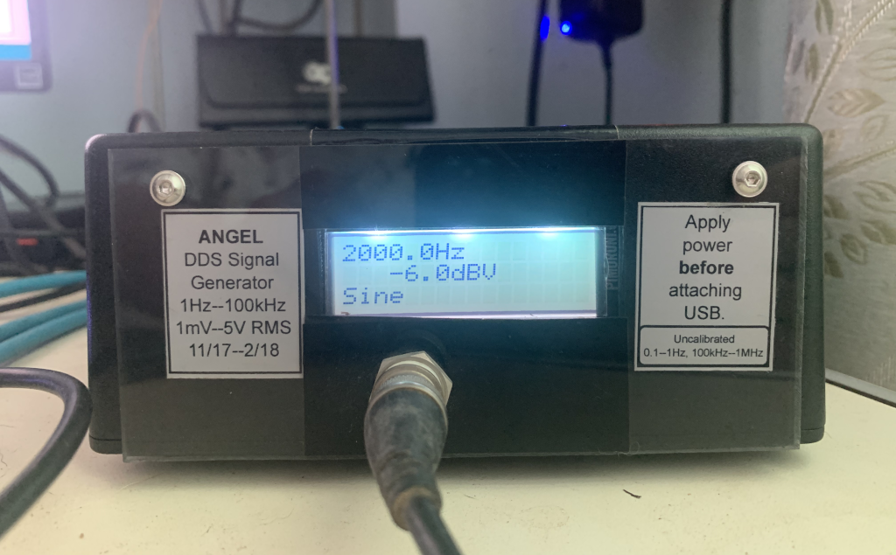

# Virtual Control Panel for a Homemade Function Generator

---


---



---

## Starting the VCP from the command line

```
$ a68g afgvcp.a68 -- --help

Virtual control panel for the ANGEL DDS function generator. V0.1
================================================================
Running under Algol 68 Genie 3.12.0

Angel Function Generator Virtual Control Panel
----------------------------------------------
-d, --device, (option) : Device number.
-f, --fake, (flag) : Do not try to connect to an AFG, but fake the device.
-s, --slow, (flag) : Update DSURF only with explicit show_display commands.
-h, --help, (flag) : Display help and exit.
```

Note that arguments for the VCP program must appear after a `--` sequence: arguments
before that are for the Algol 68 Genie interpreter.

Because the function generator is a "one-off" instrument, this program is not directly
useful (unless you build a replica of the hardware, which I would not recommend today --
if anyone is interested in that, I'll provide schematics and the Arduino software).
This program is therefore mostly useful (if at all) as an example of how to use VCPGUI
for your own devices. 

To run the program without the (unobtainable) hardware it controls, use the `--fake` flag.
All interactions will "succeed" with no attempt to access any device.

The device to communicate with is set by the `--device <n>` For example `--device 1`
will communicate via `/dev/ttyACM1`. If omitted, the default device is `/dev/ttyACM0`.

The `--slow` flag is experimental. By default, the VCP updates the display immediately
when anything changes that can affect the appearance of the GUI. If this flag is used,
updates are done only when the GUI code explicitly requests it. This can reduce "display
tearing", but there may be issues with delayed responses to button presses.

## Using the VCP

When the device is switched on, and after every "open" (e.g. when the VCP program is
run), the state is set to: Sine wave output, 1kHz frequency, 1V RMS amplitude. This
reset takes about 3 seconds, by the way.

To change the amplitude, select one of the `AMPLITUDE` functions on the radio button
under the display. This will display the current amplitude appropriately. Then press
`NEW`on the keypad, enter the desired new value with the digit keys, then press `SET`
to set the new value (whatever you enter will be clamped to the valid range for that
function and waveform). Note that on pressing the `NEW` key, the bezel of the numeric
display changes to red to indicate "new data entry mode". Pressing `OLD` instead of
`SET` will discard the entry and keep the previous value. Pressing `DEL` after
entering a digit will "backspace", removing the last entered digit. The `CHS` key
changes the sign of the entered value. The sign will be ignored if it is not relevant.

In addition to the "obvious" voltage options (RMS and peak-to-peak), the `dBV` option
allows entry in decibels referred to 1 volt. For example, `-6.02` in `dBV` corresponds to
0.5V RMS. The `dBu` option allows amplitudes to be specified in decibels referred to
the voltage that dissipates 1mW into 600 ohms (the voltage is approximately 0.775V).

The frequency can be set in the same way after selecting the `Hz` or `kHz` functions.

The output waveform can be set using the `WAVEFORM` radio button. There is one quirk
due to poor design of the hardware: moving from sine or triangle to square wave, or
from square wave to sine or triangle causes the output amplitude to be unstable for
approximately 20 seconds. When these transitions occur, the hardware sets the output 
to 0V for this period and the VCP `UNSTABLE` lamp lights. When the output is
available again, the `UNSTABLE` lamp is extinguished.

The `OFF` button causes an immediate exit from the VCP program (the device is closed
cleanly). 

The following "hot keys" are available. These must be entered using the `ALT` key
modifier.

- `ALT + Q`: Exit.
- `ALT + A`: Position the window at the top left of the display.
- `ALT + B`: Position the window at the top right of the display.
- `ALT + C`: Position the window at the centre of the display.
- `ALT + D`: Position the window at the bottom left of the display.
- `ALT + E`: Position the window at the bottom right of the display.
- `ALT + F`: Position the window at the top middle of the display.
- `ALT + G`: Position the window at the bottom middle of the display.

## Amplitude calibration

The function generator relies on a look-up table which, given a desired output voltage,
gives the required attenuator settings. The basic attenuator has 256 steps (it is an R-2R
ladder). The input to this is from another attenuator with 3 settings arranged so the 
RMS sine wave input is 5V, 500mV or 50mV. Finally, the amplifier at the output of the
ladder attenuator has 2 very slightly different selectable gains. This gives a total
of 1536 "attenuator settings". 

The look-up table is read by `angelfg.a68` when it opens the device (`afgvcp.a68`
uses `angelfg.a68` to control the device). The table is created by the program
`calibrate_afg.a68` which controls both the function generator and a Rigol DM3000 series
multimeter to measure the output at each of the 1536 "attenuator settings".

The result of these is written to a file -- the calibration file. The file read
by `angelfg.a68` is called `afg_calibration.dat`.

Here is the help information from running `calibrate_afg.a68`:

```
$ a68g calibrate_afg.a68 -- --help

AFG Amplitude Calibration Program
---------------------------------

This program generates a new calibration table for the ANGEL Function Generator
by measuring the generator output for every setting of the attenuators in the AFG.
In addition to the AFG, a Rigol 3000 series multimeter is needed, connected to
the AFG. Be careful not to overwrite the active calibration file (afg_calibration.dat)
unless you are sure you want to do that!

-g, --afg, (option) : AFG Device number.
-c, --calfile, (option) : Output calibration file name.
-r, --reset, (flag) : Reset the Rigol device on open.
-h, --help, (flag) : Display help and exit.
```
