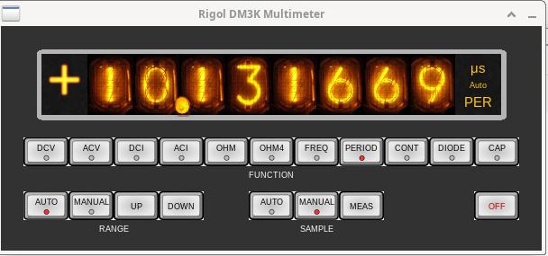
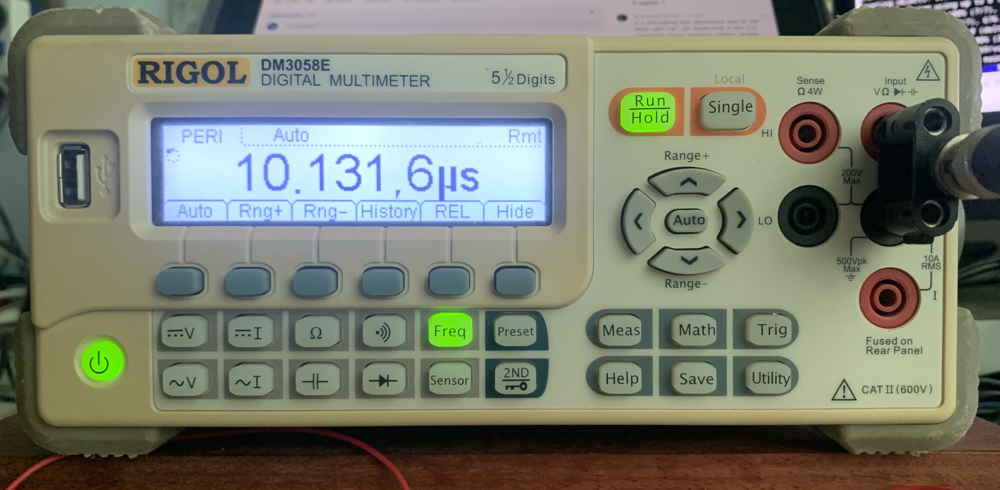

# Virtual Control Panel for a Rigol DM3000 Series Multimeter

---



---



---

## Starting the VCP from the command line

```
$ a68g rigoldm3kvcp.a68 -- --help

Virtual control panel for a Rigol DM3000 series multi-meter. V0.1
=================================================================
Running under Algol 68 Genie 3.12.0

Rigol DM3K Multimeter Virtual Control Panel
-------------------------------------------
-r, --reset, (flag) : Reset the device on open.
-h, --help, (flag) : Display help and exit.

```

Note that arguments for the VCP program must appear after a `--` sequence: arguments
before that are for the Algol 68 Genie interpreter.

It isn't necessary to specify a device. The multimeter is identified by a "vendor id"
and "product id" number pair which are publicly available and are fixed for
a specific model of multimeter. Note that a side effect of this
is that only one multimeter of a specific type can be attached to a host computer
and used by this software. This is unlikely to be a problem in practice.

By default, the multimeter is not reset when it is "opened". It will be reset if the 
`--reset` flag is used. There is a problem that I have not found a solution for, which
is that it isn't possible to know whether a function is in "auto-range" mode or not
(each function is independently in auto-range or in a "manually set" range -- the
remote control protocol can get the current range setting, but not whether that
was set manually or automatically). Resetting the device will set a known state,
but it takes about 5 seconds to complete and there may be reasons to not do it. If it
is not reset, it is possible for the function last used to be incorrectly taken to
be in "manual" ranging mode when the device is "opened". This isn't likely to be
a serious problem, but it is annoying.

## Using the VCP

This is probably largely self explanatory. 

The function selected is displayed at the lower right of the numeric display.
The units of the measured value are displayed at the upper right of the numeric
display. The range mode for the current function is displayed at the middle
right of the numeric display. This will show either `Auto` or the maximum 
measurable value of the currently selected manual range.

The `CONT` (continuity) and `DIODE` functions have no associated measurements. If
these are selected, zero will be displayed on the VCP.

The "ranging mode" for the current function is displayed on, and can be changed by,
the `RANGE` radio button. When in `MANUAL` mode, the range used can be increased
with the `UP` push button and decreased with the `DOWN` push button.

The `SAMPLE` radio button chooses either `AUTO`-matic sampling (every 2 seconds)
or `MANUAL` sampling, in which a measurement is made when the `MEAS` push button
is pressed.

The `OFF` button causes an immediate exit from the VCP program (the device is closed
cleanly). 

The following "hot keys" are available. These must be entered using the `ALT` key
modifier.

- `ALT + Q`: Exit.
- `ALT + A`: Position the window at the top left of the display.
- `ALT + B`: Position the window at the top right of the display.
- `ALT + C`: Position the window at the centre of the display.
- `ALT + D`: Position the window at the bottom left of the display.
- `ALT + E`: Position the window at the bottom right of the display.
- `ALT + F`: Position the window at the top middle of the display.
- `ALT + G`: Position the window at the bottom middle of the display.

